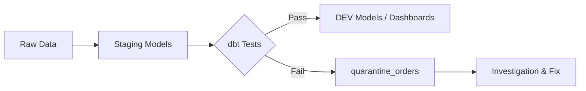

# Week 3: Data Tests

Welcome to Week 3 of the DataOps & dbt Mentorship Program! This week, we'll learn how to validate our data automatically so that quality issues are caught before they reach dashboards.

---

## ✅ Prerequisites

Before starting Week 3, make sure you have completed **all of Week 2**:

- [ ] `fct_order_details.sql` converted to incremental materialization
- [ ] `snap_products.sql` snapshot created and running
- [ ] `docs/materializations.md` written
- [ ] All models run successfully (`dbt run`)

> **If your Week 2 models are not working yet, fix them first.** Week 3 builds directly on top of them.

---

## 📖 Lesson Overview

### Why Data Testing?

Imagine a dashboard shows revenue doubled overnight — is it real growth or a bug? Without automated tests, you'd spend hours debugging. With dbt tests, you know within minutes.

Data tests answer the question: **"Is my data what I expect it to be?"**

### Two Types of dbt Tests

**Generic Tests** — pre-built checks you declare in YAML:

| Test              | What it checks                                      |
| ----------------- | --------------------------------------------------- |
| `unique`          | No two rows have the same value in this column      |
| `not_null`        | No NULL values in this column                       |
| `accepted_values` | Column only contains values from an allowed list    |
| `relationships`   | Every value exists as a foreign key in another table |

**Singular Tests** — custom SQL queries you write yourself.  
The rule is simple: **an empty result = test passes. Any rows returned = test fails.**

```sql
-- test_no_future_orders.sql
-- If this returns any rows, something is wrong
select order_id, order_date
from {{ ref('stg_orders') }}
where order_date > current_date
```

### The Quarantine Pattern

Instead of just failing tests and stopping the pipeline, a production-grade approach is to **capture bad rows** into a quarantine table with a `failure_reason` column. This way:

- The pipeline keeps running with clean data
- Analysts can investigate bad rows without scanning the full table
- Root causes can be tracked and resolved over time



---

## 📝 Assignment Tasks

### Task 3.1 — Generic Tests in schema.yml (25 pts)

Create `models/stage/schema.yml` that defines generic tests across **all 5 staging models**.

> ⚠️ **Heads up:** Some tests will intentionally **fail** — the seed data contains planted quality issues. That is expected. Your job is to write the tests and observe the failures.

**Required tests to include:**

- `stg_customers`: `customer_id` (unique, not_null), `email` (not_null, unique)
- `stg_orders`: `order_id` (unique, not_null), `customer_id` (not_null, relationships → stg_customers), `order_status` (accepted_values: pending, shipped, completed, returned, cancelled)
- `stg_order_items`: `order_item_id` (unique, not_null), `order_id` (relationships → stg_orders), `product_id` (relationships → stg_products)
- `stg_products`: `product_id` (unique, not_null)
- `stg_store_locations`: `store_id` (unique, not_null)

**Run your tests:**

```bash
dbt test --profiles-dir .
```

**Deliverable:** `models/stage/schema.yml` with generic tests on all 5 staging models.

| Criteria                        | Points |
| ------------------------------- | ------ |
| schema.yml file exists          | 5      |
| `unique` test defined           | 5      |
| `not_null` test defined         | 5      |
| `accepted_values` test defined  | 5      |
| `relationships` test defined    | 5      |

---

### Task 3.2 — Custom Singular Tests (35 pts)

Write 5 custom SQL test files in the `tests/` directory. Each query should return the **failing rows**. An empty result means the test passes.

**Tests to write:**

| File | What to check |
| ---- | ------------- |
| `tests/test_no_future_orders.sql` | Orders where `order_date > current_date` |
| `tests/test_positive_quantities.sql` | Order items where `quantity <= 0` |
| `tests/test_valid_discount_range.sql` | Order items where `discount_pct < 0` or `discount_pct > 100` |
| `tests/test_positive_shipping.sql` | Orders where `shipping_fee < 0` |
| `tests/test_positive_cost_price.sql` | Products where `cost_price <= 0` |

**💡 Template:**

```sql
-- test_no_future_orders.sql
select
    order_id,
    customer_id,
    order_date
from {{ ref('stg_orders') }}
where order_date > current_date
```

**Run your tests:**

```bash
dbt test --profiles-dir .
```

**Deliverable:** All 5 SQL files under `tests/`.

| Criteria                            | Points |
| ----------------------------------- | ------ |
| test_no_future_orders.sql exists    | 7      |
| test_positive_quantities.sql exists | 7      |
| test_valid_discount_range.sql exists| 7      |
| test_positive_shipping.sql exists   | 7      |
| test_positive_cost_price.sql exists | 7      |

---

### Task 3.3 — Quarantine Model (25 pts)

Create `models/dev/quarantine_orders.sql` — a table that captures all order rows failing quality checks, with a `failure_reason` column explaining why each row was quarantined.

**What you need to capture:**

- Orders with a future `order_date`
- Orders with a NULL `customer_id`
- Orders referencing a `customer_id` that doesn't exist in `stg_customers`
- Orders with a negative `shipping_fee`

**💡 Pattern using UNION ALL:**

```sql
{{
    config(materialized='table')
}}

with orders as (
    select * from {{ ref('stg_orders') }}
),

future_orders as (
    select *, 'future_order_date' as failure_reason
    from orders
    where order_date > current_date
),

-- ... add more CTEs for each failure type

select * from future_orders
union all
-- ...
```

**Deliverable:** `models/dev/quarantine_orders.sql`

| Criteria                            | Points |
| ----------------------------------- | ------ |
| File exists                         | 5      |
| `failure_reason` column present     | 10     |
| Uses `ref()` to staged models       | 5      |
| Multiple failure conditions captured| 5      |

---

### Task 3.4 — Data Quality Report (15 pts)

Create `docs/data_quality_report.md` documenting the data quality issues you discovered in the seed data.

**Your report should include:**

1. A list of identified issues (table, column, affected rows)
2. What test caught each issue
3. Root cause analysis (what went wrong upstream?)
4. Recommended remediation for each issue

> **Hint:** There are **14 intentionally planted issues** across the four seed tables. See how many you can find!

**Deliverable:** `docs/data_quality_report.md` with at least 150 words.

| Criteria                               | Points |
| -------------------------------------- | ------ |
| File exists                            | 5      |
| At least 150 words                     | 5      |
| Includes remediation recommendations  | 5      |

---

### Week 3 Total: **100 points**

---

## 🔧 dbt Commands Reference

```bash
# Run all tests
dbt test --profiles-dir .

# Run only generic tests
dbt test --select test_type:generic --profiles-dir .

# Run only singular tests
dbt test --select test_type:singular --profiles-dir .

# Run tests for a specific model
dbt test --select stg_orders --profiles-dir .

# Run all models + tests
dbt build --profiles-dir .
```

---

## 📂 Expected File Structure After Week 3

```
dbt_learning/
├── models/
│   ├── stage/
│   │   ├── sources.yml
│   │   ├── schema.yml              ← NEW
│   │   ├── stg_customers.sql
│   │   ├── stg_products.sql
│   │   ├── stg_orders.sql
│   │   ├── stg_order_items.sql
│   │   └── stg_store_locations.sql
│   └── dev/
│       ├── fct_order_details.sql
│       ├── dim_customers.sql
│       └── quarantine_orders.sql   ← NEW
├── tests/
│   ├── test_no_future_orders.sql   ← NEW
│   ├── test_positive_quantities.sql← NEW
│   ├── test_valid_discount_range.sql← NEW
│   ├── test_positive_shipping.sql  ← NEW
│   └── test_positive_cost_price.sql← NEW
└── docs/
    ├── materializations.md
    └── data_quality_report.md      ← NEW
```

Good luck! 🚀
